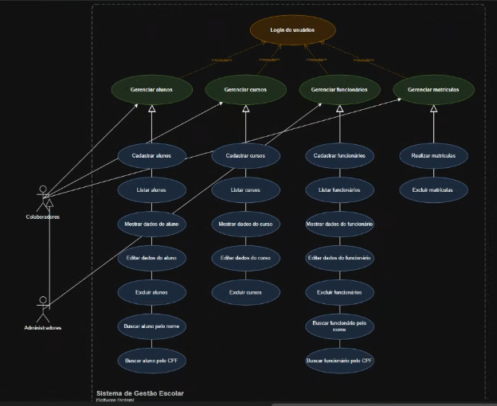
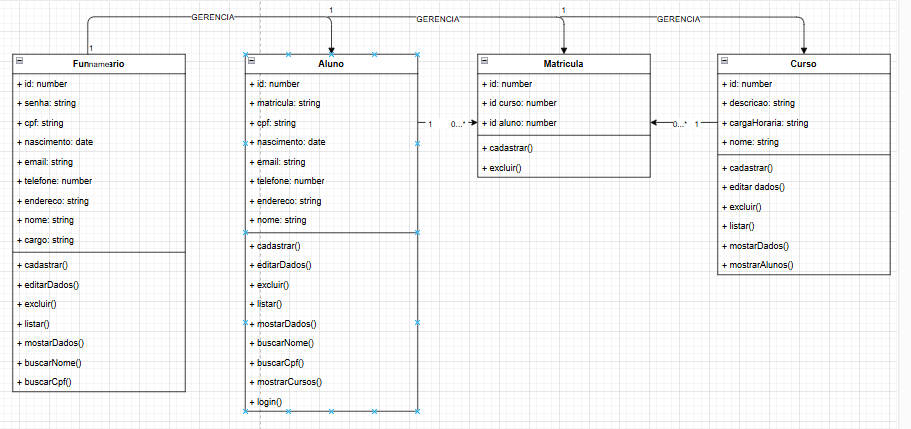

# Sistema de Gestão Escolar

## Sistema para gerenciar funcionários, alunos, cursos e matrículas

1. Quem utilizará o sistema (usuários)?
 - Funcionários

2. Quais os tipos de usuários e o que cada tipo consegue fazer?
 - Colaboradores: Cadastrar alunos, cadastrar cursos, editar dados dos alunos, editar dados dos cursos, excluir alunos, excluir cursos, listar alunos, listar cursos, matricular alunos nos cursos, desmatricular alunos dos cursos e atualizar os próprios dados
 - Admin: Todas as funções acima, mais: cadastrar outros funcionários, listar outros funcionários, editar dados dos outros funcionários e excluir outros funcionários

3. Quais informações iremos armazenar?
- Funcionários: Nome, email, cargo, data de nascimento, cpf, senha, telefone, endereço
- Alunos: Matrícula, CPF, Nome, data de nascimento, email, telefone, endereço
- Cursos: Descrição, carga horária, nome
- Matrículas: Quais alunos estão cadastrados em quais cursos

4. Quais regras ou restrições são necessárias?
- Apenas funcionários admin podem criar/deletar outros funcionários
- Funcionários colaboradores não podem editar dados de outros funcionários
- CPF não pode repetir, email não pode repetir
- Nome, email, cargo, cpf, senha, carga horária, matrícula são dados obrigatórios
- Um aluno não pode ser matriculado duas ou mais vezes no mesmo curso
- O sistema deve validar as informações

## PROBLEMA: 
 - Esse sistema e direcionado para os funcionarios de escolas
 - Permite, cadastrar, editar, listar e deletar alunos, cursos, matriculas e funcionarios

## MODELO DE NEGOCIO
   

## REQUISITOS:
1. Requisitos Funcionais:

 - Cadastrar alunos
 - Cadastrar funcionário
 - Cadastrar curso
 - Listar alunos
 - Listar curso
 - Listar funcionário
 - Mostrar os dados do aluno
 - Mostrar os dados do funcionário
 - Mostrar os dados do curso
 - Realizar as matrículas
 - Editar os dados do aluno
 - Editar os dados do funcionário
 - Editar os dados do curso
 - Excluir os alunos
 - Excluir os funcionário
 - Excluir os curso
 - Excluir as matrículas
 - Login de usuários
 - Buscar aluno pelo nome
 - Buscar aluno pelo CPF
 - Buscar funcionário pelo nome
 - Buscar funcionário pelo CPF
 - Mostrar os cursos em que cada aluno está matriculado
 - Mostrar os alunos que estão matriculados em cada curso

 - Adicionar cursos
 - Adicionar alunos
 - Adicionar funcionarios
 - Pesquisar alunos
 - Pesquisar cursos
 - Pesquisar funcionários
 - Visualizar matrículas
 - Visualizar cursos de um aluno
 - Visualizar alunos de um curso
 - Editar matrículas
 - Desmatricular alunos
 - Editar os próprios dados
 - Alterar senha
 - Realizar login
 - Realizar logout
 - Controlar permissões dos usuários
 - Validar CPF
 - Validar email
 - Verificar campos obrigatórios
 - Mostrar mensagens de confirmação
 - Confirmar exclusões
 
2. Requisitos Não Funcionais:

 - Autenticação
 - Interface com navegação padronizada e consistente entre as telas
 - Interface responsiva e adaptativa a diversas resoluções de tela e dispositivos diferentes, como computador, celular e tablet
 - Interface deve ser compatível com os principais navegadores web
 - Criptografar as senhas antes de salvá-las no banco de dados

 - Verificaçao dos dados 
 - Segurança de acesso
 - Controle de permissões
 - Proteção dos dados
 - Facilidade de uso
 - Bom desempenho
 - Integridade dos dados
 - Facilidade de manutenção

 ## REGRAS DE NEGÓCIO

 - O CPF de cada aluno deve ser unico
 - O CPF de cada funcionario deve ser unico
 - O Email de cada funcionario deve ser unico
 - A matricula de cada aluno deve ser unica
 - O nome de cada curso deve ser unico
 - Nao pode excluir cursos com alunos matriculados
 - Nao podem excluir alunos que estejam matriculados em 1 ou mais cursos

 ## CASOS DE USO

   

 ## CLASSES

   
