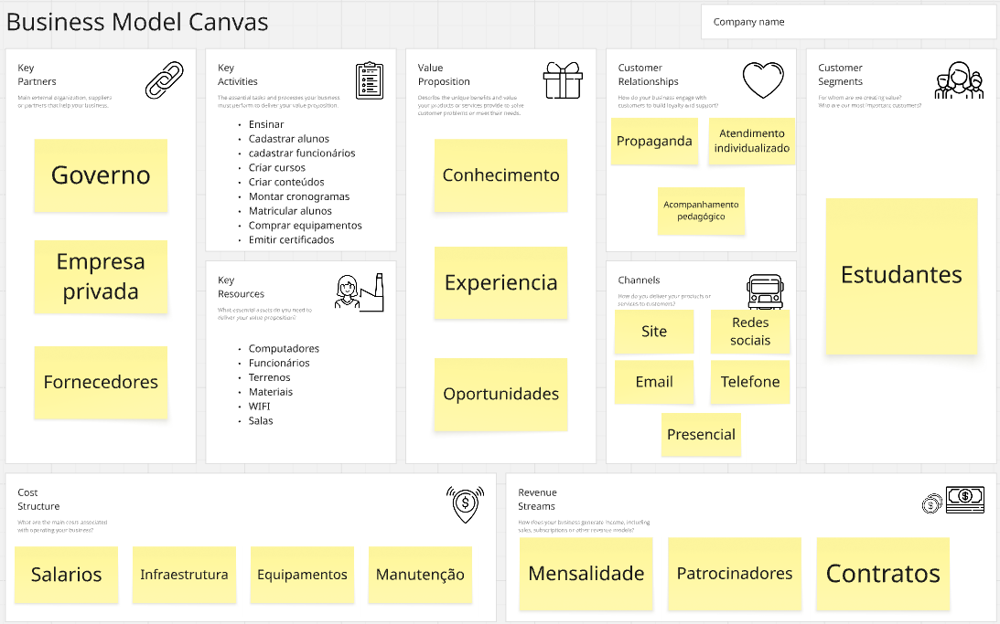

# Sistema de Gestão Escolar

## Sistema para gerenciar funcionários, alunos, cursos e matrículas

1. Quem utilizará o sistema (usuários)?
 - Funcionários

2. Quais os tipos de usuários e o que cada tipo consegue fazer?
 - Colaboradores: Cadastrar alunos, cadastrar cursos, editar dados dos alunos, editar dados dos cursos, excluir alunos, excluir cursos, listar alunos, listar cursos, matricular alunos nos cursos, desmatricular alunos dos cursos e atualizar os próprios dados
 - Admin: Todas as funções acima, mais: cadastrar outros funcionários, listar outros funcionários, editar dados dos outros funcionários e excluir outros funcionários

3. Quais informações iremos armazenar?
- Funcionários: Nome, email, cargo, data de nascimento, cpf, senha, telefone, endereço
- Alunos: Matrícula, CPF, Nome, data de nascimento, email, telefone, endereço
- Cursos: Descrição, carga horária, nome
- Matrículas: Quais alunos estão cadastrados em quais cursos

4. Quais regras ou restrições são necessárias?
- Apenas funcionários admin podem criar/deletar outros funcionários
- Funcionários colaboradores não podem editar dados de outros funcionários
- CPF não pode repetir, email não pode repetir
- Nome, email, cargo, cpf, senha, carga horária, matrícula são dados obrigatórios
- Um aluno não pode ser matriculado duas ou mais vezes no mesmo curso
- O sistema deve validar as informações

## PROBLEMA: 
 - Esse sistema e direcionado para os funcionarios de escolas
 - Permite, cadastrar, editar, listar e deletar alunos, cursos, matriculas e funcionarios

## MODELO DE NEGOCIO
   

